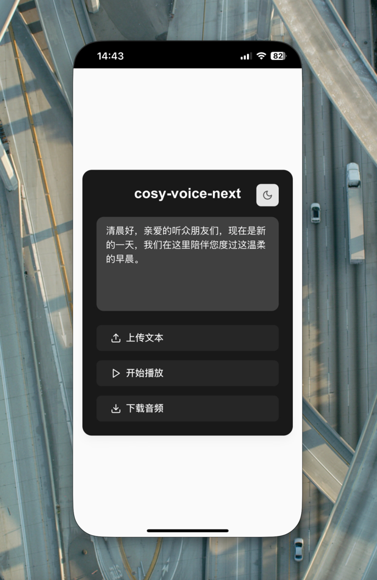

# CosyVoiceNext

[](https://github.com/Akshay090/svg-banners)

CosyVoiceNext是基于CosyVoice项目作为后端，使用Next.js构建的前端页面，支持实时流式语音生成的Web应用。

[English](README.md) | [在线预览](https://cosy-voice-next-gyiysg89i-tatertots-projects.vercel.app/)

## ✨ 特性

- 🎯 简洁优雅的用户界面
- 🌓 支持深色/浅色主题切换
- 📝 支持文本输入和TXT文件上传
- 🎵 实时语音播放功能
- 💾 支持音频下载为WAV格式
- 💫 流畅的动画过渡效果
- 📱 响应式设计，支持移动端

## 🎥 演示

请观看视频演示（请打开声音）：

[视频演示](https://private-user-images.githubusercontent.com/102522568/399543480-dc1aed67-8947-45e7-876a-cd2dfc52aa6a.mp4)

## 📱 移动端展示


## 🛠 技术栈

- Next.js
- React
- TypeScript
- WebSocket
- Web Audio API
- Tailwind CSS
- Lucide Icons

## 🚀 快速开始

### 开发环境

```bash
# 克隆项目
git clone https://github.com/TaterTotX/CosyVoiceNext.git

# 安装依赖
cd cosy-voice-next
npm install

# 启动开发服务器
npm run dev
```

### Docker环境

```bash
# Windows系统
start.bat

# Mac/Linux系统
sh start.sh
```

## 🔧 网络配置

修改`.env.local`文件，添加以下配置：

```env
# 用于连接CosyVoice客户端
NEXT_PUBLIC_WS_URL=你的WebSocket服务器地址

# 用于下载Docker配置文件
HTTPS_PROXY=你的代理地址
HTTP_PROXY=你的代理地址
```

## 📝 使用指南

1. 在文本框中输入要转换的文字，或上传TXT文本文件
2. 点击"开始播放"按钮，即可听到转换后的语音
3. 播放过程中可随时点击"停止播放"断开连接
4. 点击"下载音频"可将当前音频保存为WAV文件
5. 点击右上角主题切换按钮可切换深色/浅色模式

## 📄 开源协议

[MIT License](LICENSE)